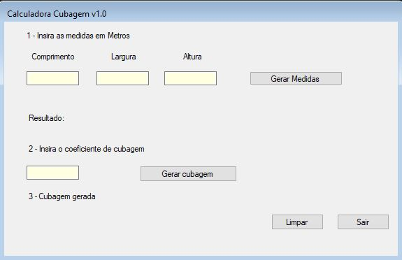

<h1>Calculadora-de-Cubagem</h1>

Aplicação criada para o aprendizado da linguagem de programação C#.

A aplicação foi uma forma de converter uma planilha em excel que realizava o cálculo para um programa na qual facilita a geração do coeficiente a ser usado na aplicação de ecommerce da plataforma [ezcommerce](https://www.agenciaeplus.com.br/ez-commerce-e-adquirida-pela-linx/) na qual o lojista configura o coeficiente de cubagem informado pela sua transportadora. Esse coeficiente detemina qual o valor do frete exibido para o cliente na cotação do carrinho.

Foi usado para esta aplicação C# com windows forms.

